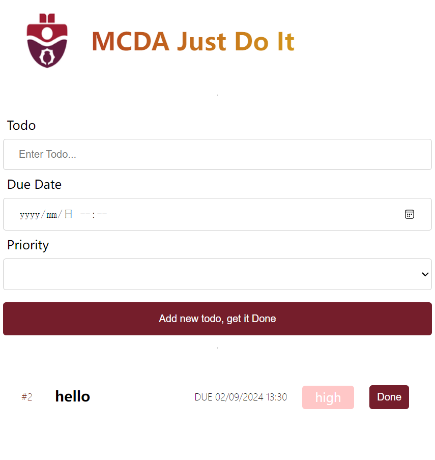

# MCDA Just Do

This app showcases the combined usage of **IndexedDB** and **localStorage** for a PWA todo app in modern web browsers.

## Key Features of MCDA Just Do It

- **Offline Access**:
As a PWA app, it doesn't require internet connection, and can be downloaded as a standalone app.

-**ToDo item display** List all ToDo items in a list, with display of relevant information such as due date, priority, and done button.

- **Priority and Due Date** User can add Priority and Due Date upon creation.

- **Rely on IndexedDB for backend database** Use IndexedDB as a database for better asynchronous access and more versatile capability. localStorage is used as a buffer for a more fluent and reactive web experience.

## Application

## Running the Application

1. **Installation**:

   - Run `npm i` or `npm install` to install the necessary packages.

2. **Starting the App**:
   - Execute `npm run start` to launch the app using [`http-server`](https://github.com/http-party/http-server#readme).

## Important Note

- **Don't just List it, just do it:** Currently there is no functionality to get the listed items done on your behalf.
